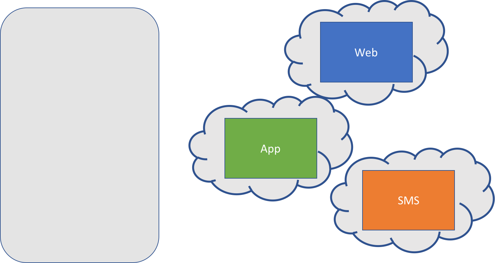

# Lab Step 3



Refactor SMS into a Docker container

* Web Service already refactored to container
* API Service Already refactored to container

# Steps 

## Vagrantfile Updates 

1. Destroy current Vagrant box 

    ```bash
    vagrant destroy
    ```

1. We will no longer use the Vagrantfile so not making the edits to disbable SMS

## ngrok Local Installation

1. Install ngrok on your local workstation.  
    * We will now be running the SMS service on our local workstations.  
    * To enable the Tropo Cloud to communicate with your application, we will use ngrok to build a local tunnel to expose our app to the internet.
    * For this lab, we'll download and run ngrok within our local /tmp directory   
    * Instructions for Mac
        * Note... if you don't have `wget` or `unzip` installed on your Mac use [Homebrew](http://brew.sh) to install with `brew install wget unzip`
    
        ```bash
        cd /tmp
        wget https://bin.equinox.io/c/4VmDzA7iaHb/ngrok-stable-darwin-amd64.zip
        unzip ngrok-stable-darwin-amd64.zip    
        ```
                     
1. Start a local tunnel using ngrok for port 15001, the port we will run the SMS service on.
                   
    ```
    cd /tmp 
    ./ngrok http 15001
    ```
    
1. Make note of the "forwarding address" for "http:".  Example output below.  You will need this when `docker run` the sms service shortly.  

    ```
    ngrok by @inconshreveable                                                                                                                                                        (Ctrl+C to quit)
                                                                                                                                                                                                     
    Session Status                online                                                                                                                                                             
    Version                       2.2.4                                                                                                                                                              
    Region                        United States (us)                                                                                                                                                 
    Web Interface                 http://127.0.0.1:4040                                                                                                                                              
    Forwarding                --> http://35b6bf73.ngrok.io -> localhost:15001                                                                                                                         
    Forwarding                    https://35b6bf73.ngrok.io -> localhost:15001                                                                                                                        
                                                                                                                                                                                                     
    Connections                   ttl     opn     rt1     rt5     p50     p90                                                                                                                        
                                  0       0       0.00    0.00    0.00    0.00    
    ```
         
## Docker File Creation 

1. Create new empty file called `Dockerfile` within the `./sms` directory 

    ```bash
    cd sms
    touch Dockerfile
    ```

1. Boilerplate python/2.7-alpine Dockerfile 

    ```
    FROM python:2.7-alpine
    
    # Install basic utilities
    RUN apk add -U \
            ca-certificates \
      && rm -rf /var/cache/apk/* \
      && pip install --no-cache-dir \
              setuptools \
              wheel    
    ```
    
1. Add sms code and port details
  
    ```
    FROM python:2.7-alpine
    EXPOSE 5001
    
    # Install basic utilities
    RUN apk add -U \
            ca-certificates \
      && rm -rf /var/cache/apk/* \
      && pip install --no-cache-dir \
              setuptools \
              wheel
    
    # Create application directories
    RUN mkdir /app
    
    # Prep Required Environment Variables
    # These are default placeholders but should be overridden
    # when running the container
    #   ** TROPO_PREFIX can be left as 1419 unless you want to change
    ENV TROPO_USER="tuser" \
        TROPO_PASS="tpass" \
        TROPO_PREFIX="1419" \
        TROPO_URL="http://"
    
    # Copy needed application requirements file into image
    ADD requirements.txt /app
    
    # Install Python requirements
    RUN pip install -r /app/requirements.txt
    
    # Copy application code into image
    ADD haciendo_sms.py /app      
    ```
    
1. Add CMD to start Haciendo
    
    ```
    FROM python:2.7-alpine
    EXPOSE 5001
    
    # Install basic utilities
    RUN apk add -U \
            ca-certificates \
      && rm -rf /var/cache/apk/* \
      && pip install --no-cache-dir \
              setuptools \
              wheel
    
    # Create application directories
    RUN mkdir /app
    
    # Prep Required Environment Variables
    # These are default placeholders but should be overridden
    # when running the container
    #   ** TROPO_PREFIX can be left as 1419 unless you want to change
    ENV TROPO_USER="tuser" \
        TROPO_PASS="tpass" \
        TROPO_PREFIX="1419" \
        TROPO_URL="http://"
    
    # Copy needed application requirements file into image
    ADD requirements.txt /app
    
    # Install Python requirements
    RUN pip install -r /app/requirements.txt
    
    # Copy application code into image
    ADD haciendo_sms.py /app    
    
    # Run the application
    CMD cd /app && python haciendo_sms.py \ 
                            -p 5001 \
                            -t ${TROPO_USER} \
                            -w ${TROPO_PASS} \
                            --tropoprefix ${TROPO_PREFIX} \
                            --tropourl ${TROPO_URL}      
    ```        

## Build Docker image

1. Build the image

    ```
    cd sms
    docker build -t haciendo_sms . 
    ```

## Run Docker image

1. Determine your local workstation's IP address.  
    * Needed to provide the address for the SMS server to the API Container
    * Can't use "localhost" because within the container, "localhost" means the container, not your workstation
    
    ```
    # Most Macs use en0 for Wifi, yours might be different
    ifconfig en0
    ```
    
    * Remember this IP for the next command

1. Run SMS container in interactive mode to view the startup and logs
    * Insert your workstation IP address into the command below
    * Insert the HTTP url from ngrok into the command below for TROPO_URL_
    * Insert your TROPO_USER and TROPO_PASS into the command below

    ```
    docker run -it  \
               --env TROPO_USER=<TROPO_USER> \
               --env TROPO_PASS=<TROPO_PASS> \
               --env TROPO_URL=<NGROK URL> \
               -p 15001:5001 \
               haciendo_sms 
    ```

1.  Test the containerized SMS Service
    * Insert your workstation IP address into the command below
    * Insert your phone number (or if your number is NON-US a friends)

    ```bash
    curl <YOUR IP ADDRESS>:15001/hello/<YOUR PHONE NUMBER>  
    ```
        
1. Run API container in interactive mode to view the startup and logs
    * Insert your workstation IP address into the command below

    ```
    docker run -it --env SMS_SERVER=http://<YOUR IP ADDRESS>:15001 -p 15000:5000 haciendo_api 
    ```

1.  Test the containerized API Service

    ```bash
    curl -X POST <YOUR IP ADDRESS>:15000/api/score \
      -d 'line=hello' \
      -d 'phonenumber=55555555555'
    ```

1. Open another terminal window and run WEB container in interactive mode to view the startup and logs
    * Insert your workstation IP address into the command below

    ```
    docker run -it --env API_SERVER=http://<YOUR IP ADDRESS>:15000 -p 15080:80 haciendo_web 
    ```
        
1. Access the new containerized version of the Web Interface by opening `http://<YOUR IP ADDRESS>:15080` in a browser

1. Send a message to test that all is working

